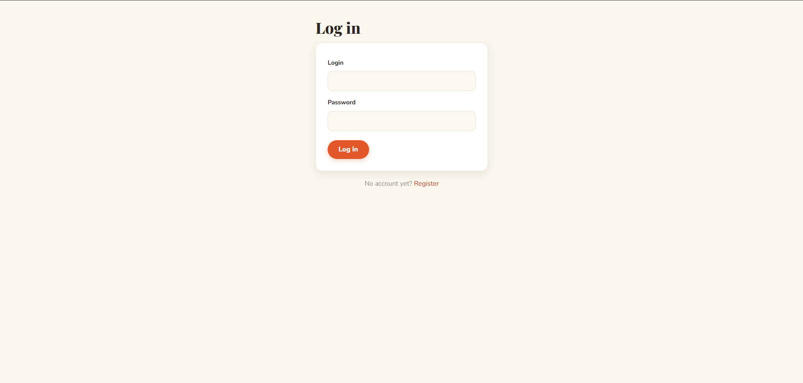
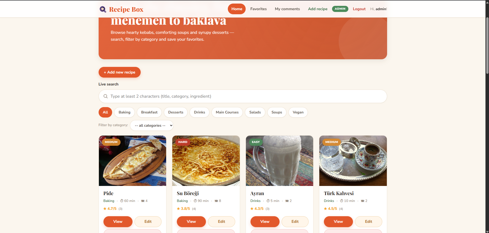
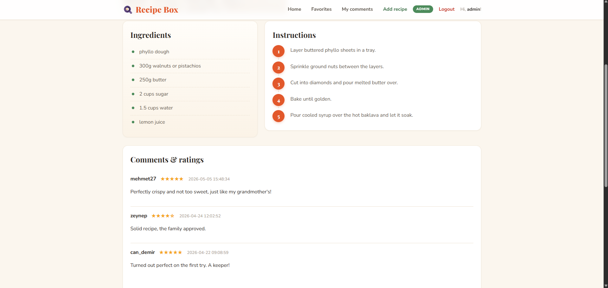
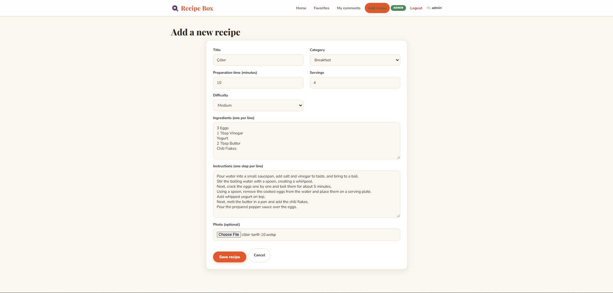
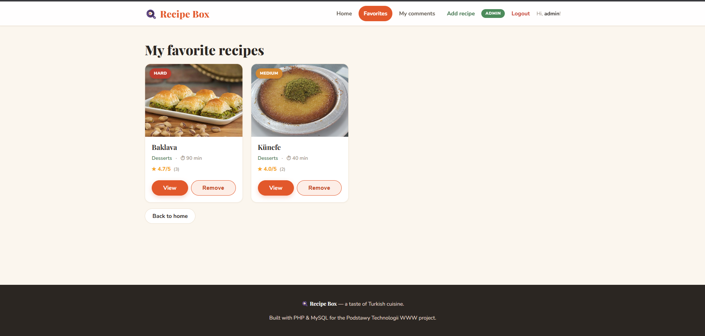
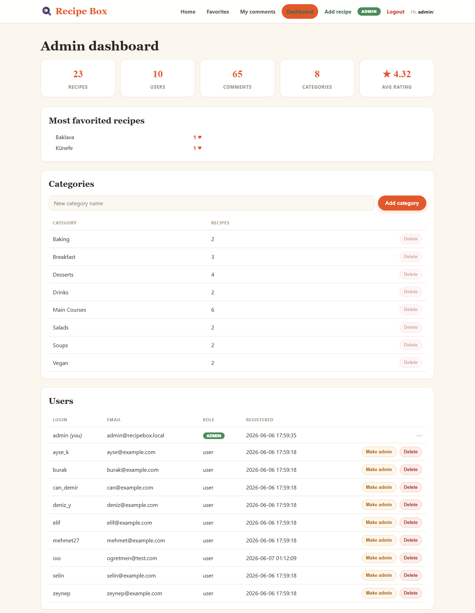
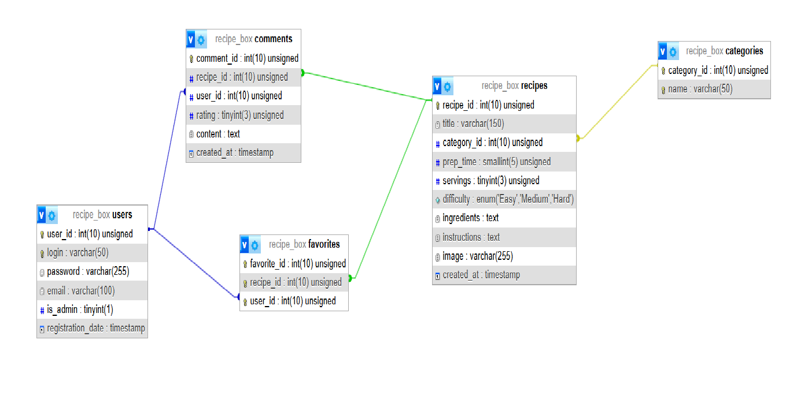

# Recipe Box — A Turkish Recipe Sharing Web Application

**University of Siedlce — Faculty of Exact and Natural Sciences — Computer Science**
**Subject:** Fundamentals of Web Technologies (Podstawy Technologii WWW)

**Author:** Süleyman Efe Metik, Erasmus exchange student, Computer Science
**Supervisor:** Wojciech Nabiałek
**Subject coordinator:** Waldemar Bartyna
**Siedlce, academic year 2025/2026, summer semester**

---

## Table of contents
1. Project goal
2. GitHub repository
3. Installation and running
4. List of functionalities
5. Security
6. Presentation of the application
7. Database table diagram

---

## 1. Project goal

The goal of this project was to design and implement a fully functional recipe-sharing web application dedicated to Turkish cuisine. The application, called **Recipe Box**, lets users create an account, browse a catalogue of recipes, search and filter them, save their favourites, and share their opinions through comments and star ratings.

The system distinguishes between regular users and administrators. Regular users can browse, search, favourite and comment on recipes, while administrators additionally manage the recipe catalogue — adding, editing and deleting recipes together with their photos. The application was built with PHP and a MySQL database using prepared statements, server- and client-side validation, CSRF protection and asynchronous (AJAX) requests, and it is fully responsive.

**Division of work:** the project was carried out individually, therefore no division of work applies.

## 2. GitHub repository

The complete source code of the application is available in the following public repository:

**https://github.com/bensullu/recipe-box**

## 3. Installation and running

**Requirements:** XAMPP (Apache + MySQL/MariaDB) with PHP 8 or newer.

1. Copy the project into `C:\xampp\htdocs\recipes`, or clone it:
   `git clone https://github.com/bensullu/recipe-box.git`
2. Start **Apache** and **MySQL** in the XAMPP Control Panel.
3. Create the database: open `http://localhost/phpmyadmin`, go to the **SQL** tab, paste the contents of `setup.sql` and run it (this creates the `recipe_box` database with all tables).
4. Open the application at `http://localhost/recipes/`.
5. Register an account, then grant it administrator rights by running in phpMyAdmin:
   `UPDATE users SET is_admin = 1 WHERE login = 'your_login';`
6. Log back in — you can now add, edit and delete recipes. Uploaded photos are stored in the `images/` folder.

## 4. List of functionalities

The developed application allows the following:

- registration and login of users (passwords stored as bcrypt hashes), and logout;
- a role division into a regular user and an administrator;

A **regular user** can:
- browse the list of recipes and open a recipe details page;
- search recipes by phrase with a live AJAX search (title, category, ingredients);
- filter recipes by category, both through links and a drop-down list;
- add recipes to favourites and remove them asynchronously (AJAX);
- add a comment with a 1–5 star rating and delete their own comments (AJAX).

An **administrator** can additionally:
- add new recipes together with a photo upload;
- edit existing recipes, including replacing the photo;
- delete recipes (related comments and favourites are removed automatically);
- open an **admin dashboard** with site statistics (recipes, users, comments, average rating) and the most-favorited recipes;
- **manage categories** — add and delete categories;
- **manage users** — grant or revoke administrator rights and delete users;
- **moderate comments** — delete any comment directly from the recipe page via AJAX.

Other features:
- uploading and displaying recipe photos;
- quick in-app navigation (a category name on a recipe page links to the filtered list);
- a shared page layout (header/footer) and a consistent, responsive graphic style.

## 5. Security

Security was treated as a first-class concern throughout the application:

- **Password hashing** — user passwords are never stored in plain text; they are hashed with bcrypt (`password_hash` / `password_verify`).
- **SQL injection protection** — every database query uses prepared statements with bound parameters (`mysqli` `bind_param`); no user input is concatenated into SQL.
- **XSS protection** — all user-supplied data is escaped with `htmlspecialchars()` before being printed in HTML.
- **CSRF protection** — every state-changing form (add/edit recipe, add comment) carries a random per-form token that is verified on the server.
- **Authentication & authorization** — access is session-based; administrator-only pages are protected by a guard, and the role is checked via the `is_admin` flag.
- **Server-side validation** — all input is validated on the server in addition to the HTML5/JavaScript checks, so the client is never trusted.
- **Secure file uploads** — uploaded photos are checked for MIME type and allowed extensions and saved under unique, generated file names.
- **Impersonation & ownership** — a comment's author is taken from the session (`user_id`), never from the form, and users can only delete their own comments.
- **No information leakage** — raw database errors are logged on the server and never shown to the user.

## 6. Presentation of the application

*Figure 1. The login screen. New visitors can create an account from the registration page; passwords are validated and stored as bcrypt hashes.*

*Figure 2. The home page: a hero banner, a live search box, category filters (links and a drop-down) and a responsive grid of recipe cards with photos, difficulty tags and average star ratings.*

*Figure 3. A recipe details page showing the photo, the ingredient list, numbered preparation steps and the comments section with users' star ratings.*

*Figure 4. The administrator form for adding a new recipe — title, category, preparation time, servings, difficulty, ingredients, instructions and a photo upload.*

*Figure 5. The favourites page, listing the recipes saved by the currently logged-in user.*

*Figure 6. The admin dashboard — site statistics, most-favorited recipes, category management and user management. Administrators can also moderate (delete) any comment from a recipe page via AJAX.*

## 7. Database table diagram

The database consists of five related tables: **users**, **categories**, **recipes**, **comments** and **favorites**. The diagram below shows the tables, their columns and the foreign-key relationships between them.

*Figure 7. Entity–relationship diagram of the recipe_box database (generated from phpMyAdmin).*
